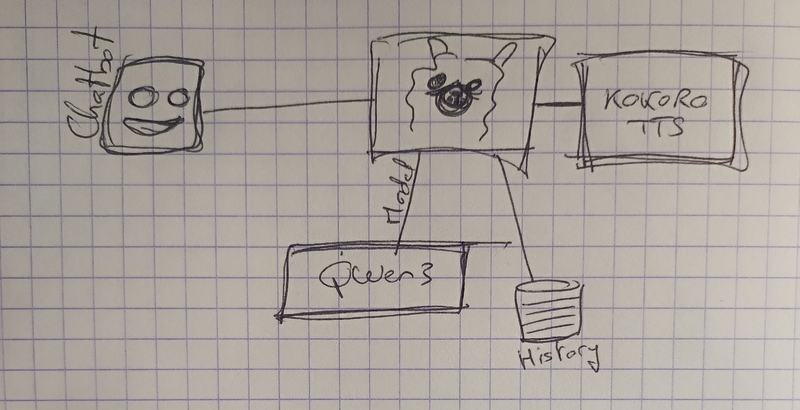
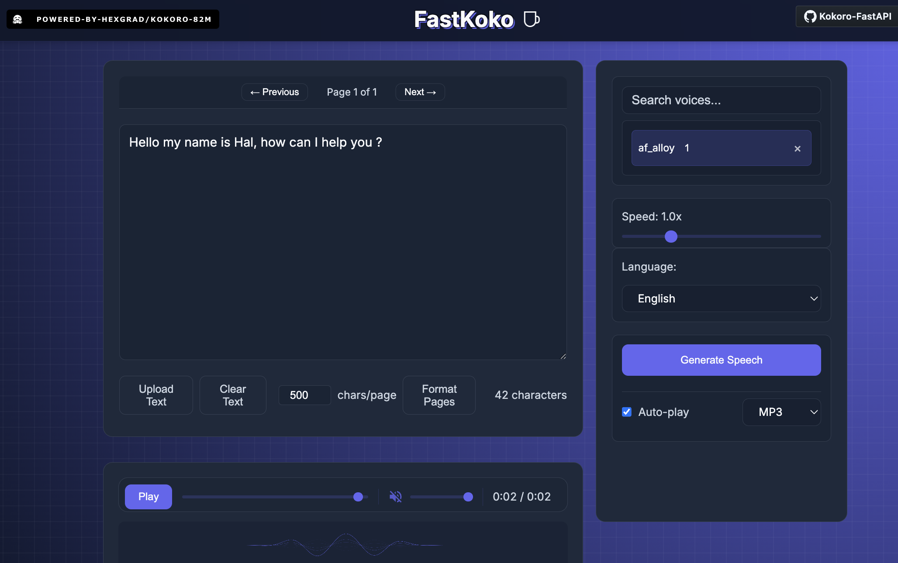
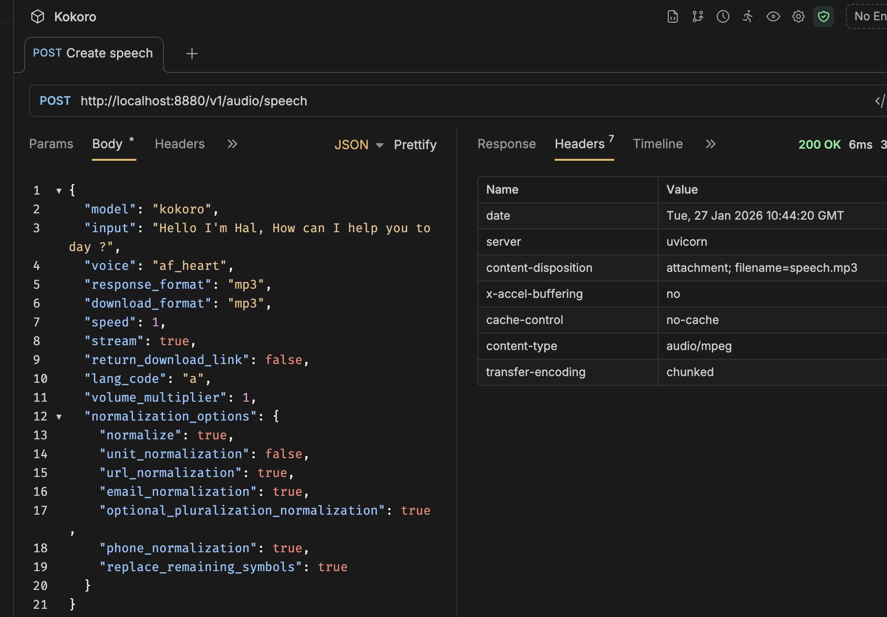
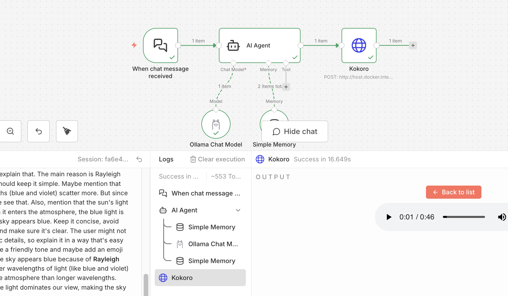
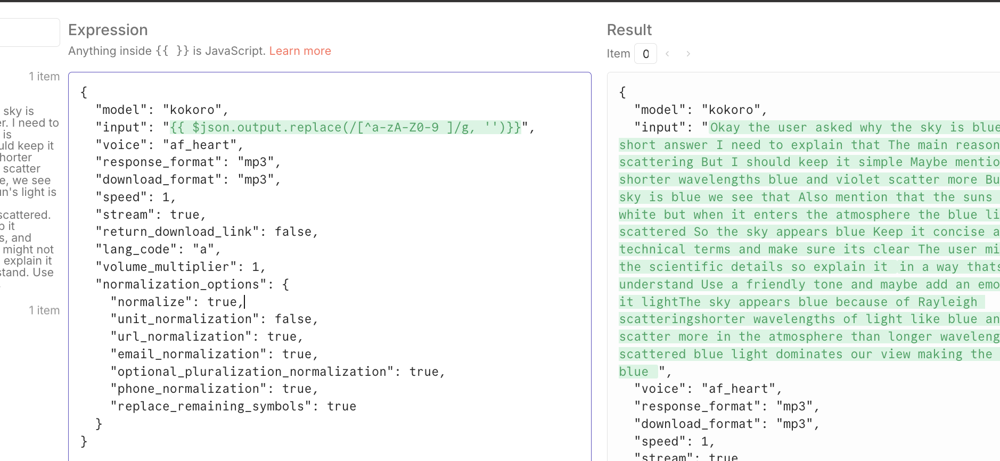

# Kokoro

## Text To Speech

> Technology that enables text to be converted into speech sounds imitative of the human voice.

**My idea**



### Run locally

- Kokoro
- Ollama
- n8n

**Kokoro with FastAPI**

* https://github.com/remsky/Kokoro-FastAPI

```sh
docker run -p 8880:8880 ghcr.io/remsky/kokoro-fastapi-cpu:latest
```

And you can play with web ui:
* http://localhost:8880/web




### n8n workflow with Kokoro

> I want to hear Qwen answer :blush:

First I tested kokoro API with Bruno.



And then I added it to a new n8n workflow.



I had to remove all special characters.



