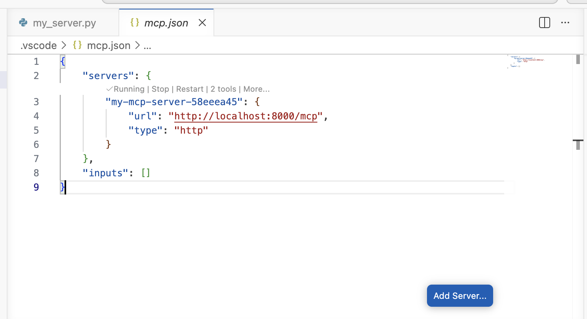
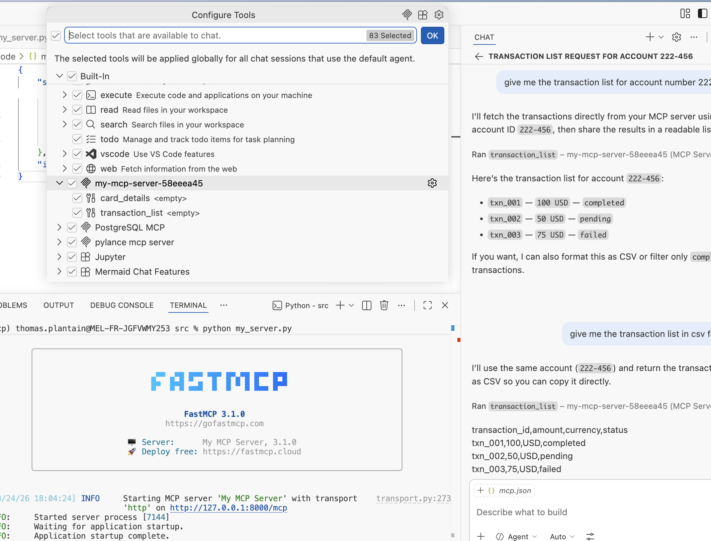
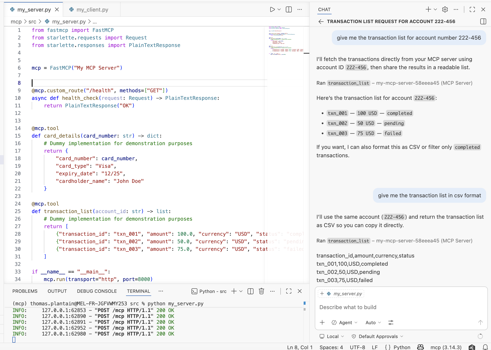

# MCP

- [MCP](#mcp)
  - [MCP Kesako ?](#mcp-kesako-)
  - [Prototype du service MCP](#prototype-du-service-mcp)
    - [Pour commencer](#pour-commencer)
    - [Serveur MCP Card Details](#serveur-mcp-card-details)
  - [Configuration de Copilot](#configuration-de-copilot)
    - [Utilisation du service](#utilisation-du-service)
  - [Prochaines étapes](#prochaines-étapes)


## MCP Kesako ?

> Protocole de communication entre un agent IA et un service.


Le service permet à un agent d'avoir accès à des données structurées (format JSON) qui ne sont pas déjà présentes dans son modèle LLM.
Il existe deux protocoles de communication, io et http. Dans mon cas, je souhaite utiliser http, dans l'idée de créer un serveur MCP accessible à tous.


Pour accélérer le développement, je vais utiliser la librairie Python fastMCP :

- fastMCP: https://gofastmcp.com/getting-started/welcome


## Prototype du service MCP


> Mon cas d'utilisation : je veux mettre en place un service qui donne les détails d'une carte de crédit si on lui donne le numéro en paramètre, ou la liste des transactions d'un compte.


Dans ce premier post, je ne vais pas aborder la sécurité ni l'observabilité, mais je souhaite en parler bientôt dans un post dédié, notamment via une API Gateway.


### Pour commencer

Dans un environnement Python :
```sh
pip install fastmcp
```


### Serveur MCP Card Details

J'ai créé deux services : le détail d'une carte et la liste des transactions d'un compte, avec des données fictives.

```python
from fastmcp import FastMCP
from starlette.requests import Request
from starlette.responses import PlainTextResponse

mcp = FastMCP("My MCP Server")

@mcp.custom_route("/health", methods=["GET"])
async def health_check(request: Request) -> PlainTextResponse:
    return PlainTextResponse("OK")

@mcp.tool
def card_details(card_number: str) -> dict:
    # Dummy implementation for demonstration purposes
    return {
        "card_number": card_number,
        "card_type": "Visa",
        "expiry_date": "12/25",
        "cardholder_name": "John Doe"
    }

@mcp.tool
def transaction_list(account_id: str) -> list:
    # Dummy implementation for demonstration purposes
    return [
        {"transaction_id": "txn_001", "amount": 100.0, "currency": "USD", "status": "completed"},
        {"transaction_id": "txn_002", "amount": 50.0, "currency": "USD", "status": "pending"},
        {"transaction_id": "txn_003", "amount": 75.0, "currency": "USD", "status": "failed"}
    ]

if __name__ == "__main__":
    mcp.run(transport="http", port=8000)    
```


Pour lancer le serveur qui va écouter sur le port 8000, j'exécute :

```sh
python my_server.py
```


## Configuration de Copilot

Une fois que le serveur MCP tourne dans la console, je configure mon GitHub Copilot pour qu'il ajoute le serveur dans sa liste :




Une fois la configuration faite, on peut voir le serveur et les deux fonctionnalités (`card_details` et `transaction_list`) :




### Utilisation du service

Les deux fonctionnalités sont maintenant accessibles dans le chat de Copilot :



## Prochaines étapes

- Mettre en place une API Gateway
    - Authentification
    - Observabilité
    - Limitation, quotas
