# RAG with n8n

- [RAG with n8n](#rag-with-n8n)
  - [Overview](#overview)
  - [Before you start](#before-you-start)
    - [What's RAG](#whats-rag)
    - [What's you need](#whats-you-need)
  - [Installation](#installation)
    - [n8n](#n8n)
    - [Qdrant](#qdrant)
    - [Ollama](#ollama)
  - [RAG Workflow](#rag-workflow)
    - [Data ingestion](#data-ingestion)
      - [Qdrant collections](#qdrant-collections)
    - [Chatbot](#chatbot)
  - [See also](#see-also)
    - [SML (Small Language Model)](#sml-small-language-model)
    - [Links](#links)


## Overview

This guide explains how to implement a RAG (Retrieval Augmented Generation) on your laptop.

- Embedded AI
- Data sovereignty

## Before you start

### What's RAG

> RAG (retrieval augmented generation) is a technology that improves the responses of generative AI models by feeding them with knowledge from internal databases.

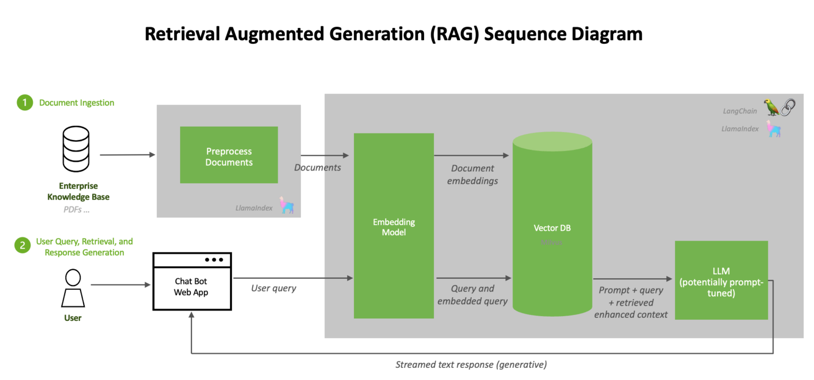

### What's you need

Before you put the RAG in place, ensure you already have:

* Docker
* Ollama
* md files

## Installation


### n8n

> n8n is a workflow automation platform that gives technical teams the flexibility of code with the speed of no-code.

**Run locally**

```sh
docker volume create n8n_data
docker run -it --rm --name n8n -p 5678:5678 -v n8n_data:/home/node/.n8n docker.n8n.io/n8nio/n8n
```

Go to the web [n8n Dashboard](http://localhost:5678/home/workflows):

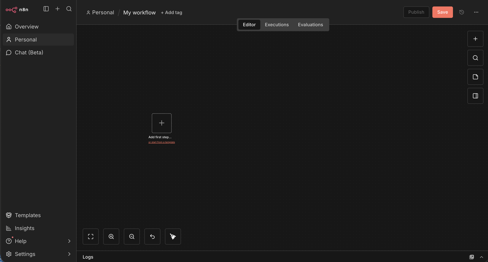


### Qdrant

> Qdrant (read: quadrant) is a vector similarity search engine and vector database. It provides a production-ready service with a convenient API to store, search, and manage points—vectors with an additional payload Qdrant is tailored to extended filtering support. 

**Run localy**

```sh
docker volume create qdrant_data
docker run -p 6333:6333 -v qdrant_data:/qdrant/storage qdrant/qdrant
```

[qdrant Dashboard](http://localhost:6333/dashboard)


### Ollama

> Ollama is the easiest way to get up and running with large language models such as gpt-oss, Gemma 3, DeepSeek-R1, Qwen3 and more.


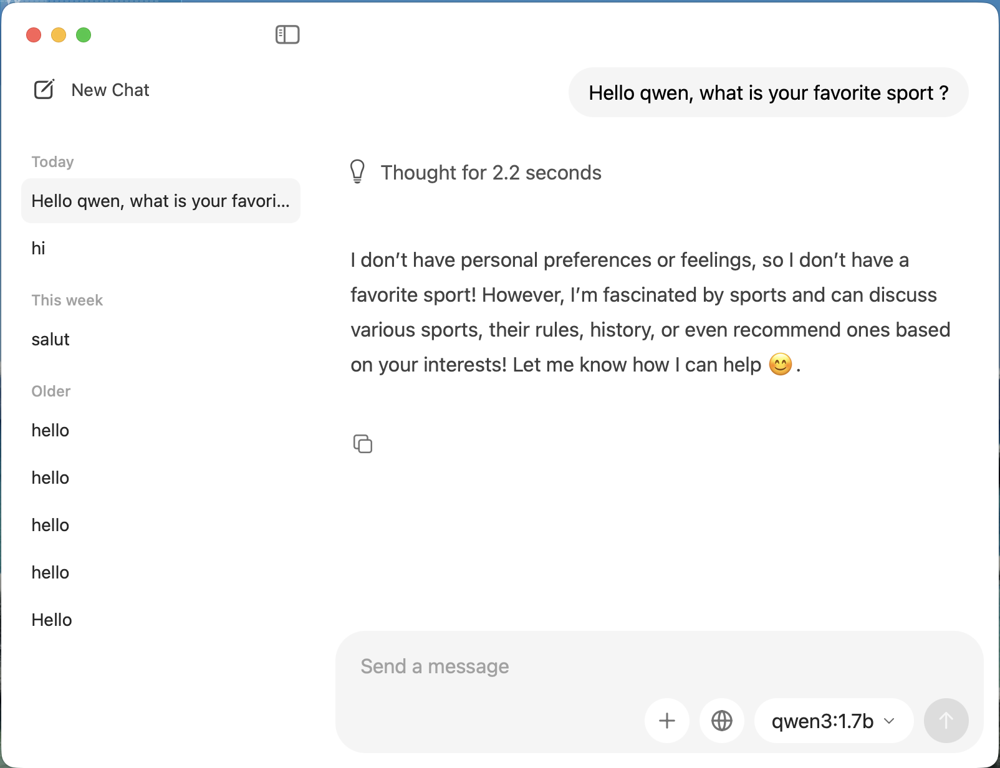


## RAG Workflow

The RAG is composed in 2 workflows.

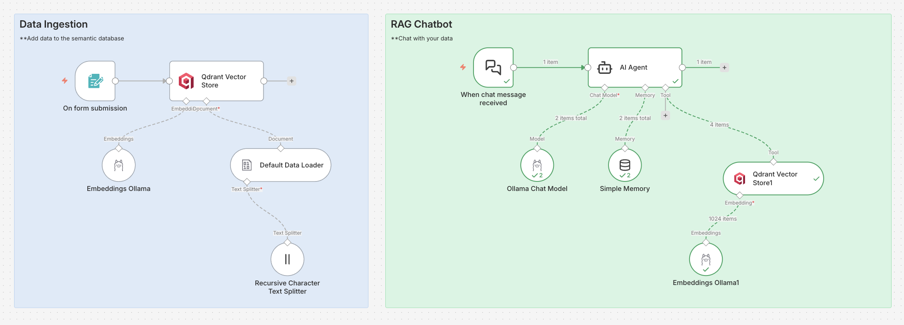

### Data ingestion

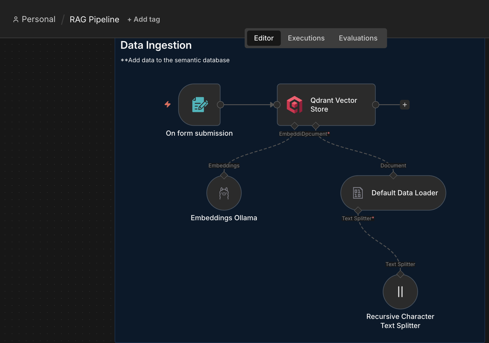

It starts with the file submission trigger, to upload CVs (in markdown format).

We add Qdrant connector to store the files in the vector database. We need an embed model to split the files into vectors.

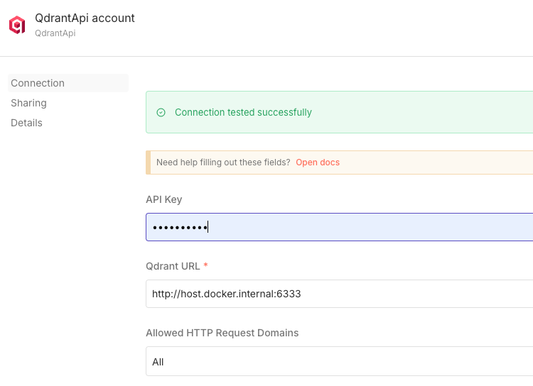

- Emebed model: mxbai-embed-large

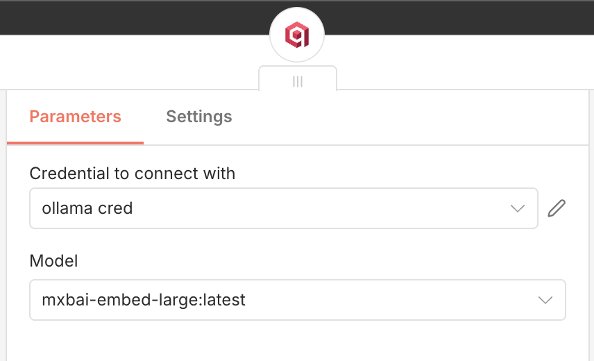

#### Qdrant collections

When the Data Ingestion workflow is executed, you can go to Qdrant dashboard to see the collections.

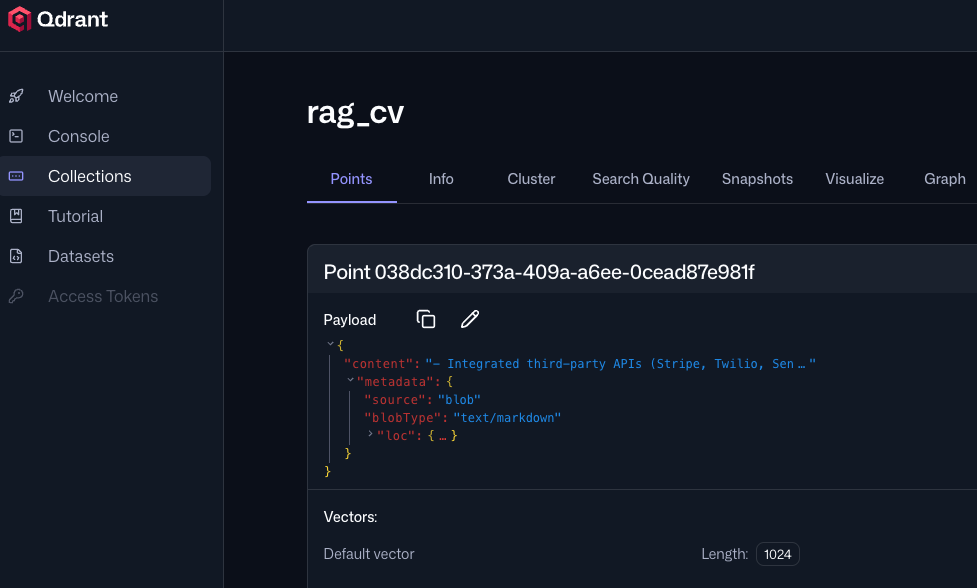

### Chatbot

> Now the CVs are in the Qdrant vector database, we can chat to request some informations about the candidate.

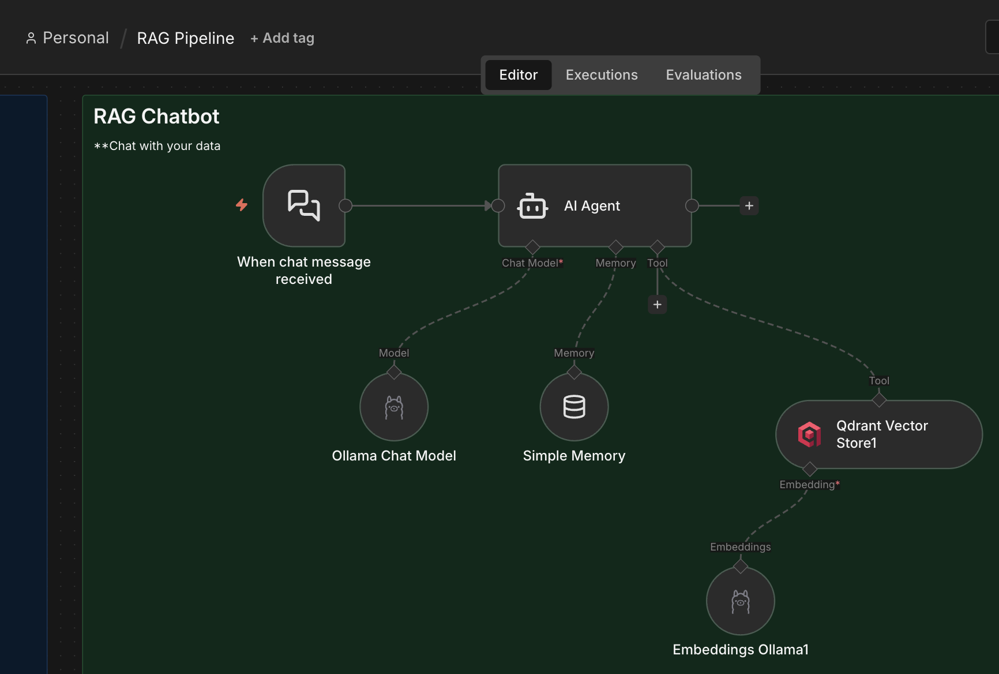

We start with the Chat trigger connected to an AI agent, with Qwen3 model.

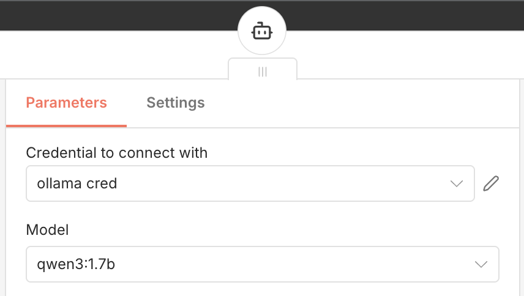

We create the tool to be able to search in our Qdrant collection and we had a simple prompt.

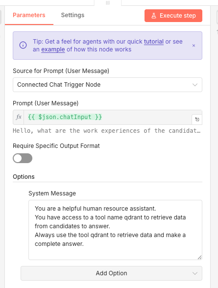

:fire: And finaly we test our chat by asking informations about a candidate.
We can see that the agent called qdrant to retrieve the data and generate a nice answer.

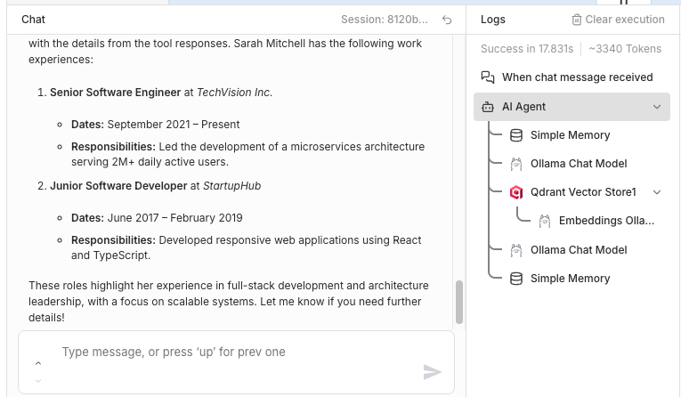


## See also

### SML (Small Language Model)

> Small language models, on the other hand, use far fewer parameters, typically ranging from a few thousand to a few hundred million. This make them more feasible to train and host in resource-constrained environments such as a single computer or even a mobile device.


### Links

* [n8n link](https://github.com/n8n-io/n8n)
* [Qdrant link](https://github.com/qdrant/qdrant)
* [Ollama link](https://github.com/ollama/ollama)
